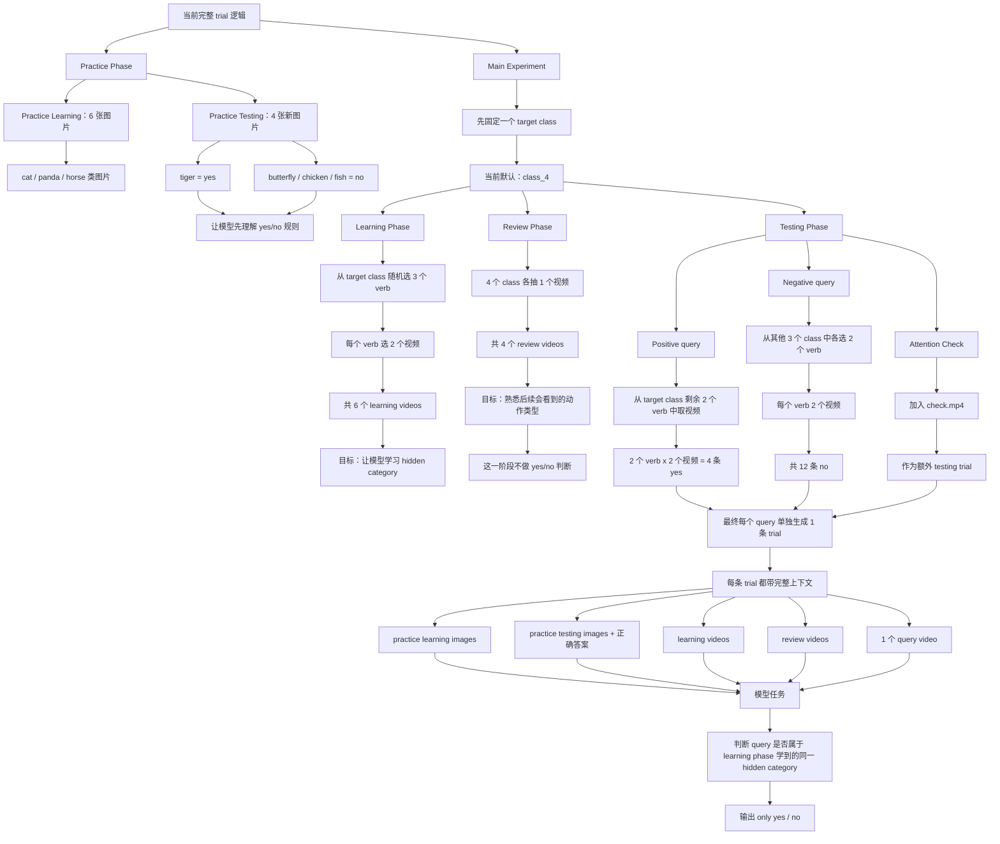

# few-shot-learning-task

```mermaid
flowchart TD

A["当前完整 trial 逻辑"] --> A1["Practice Phase"]
A1 --> A2["Practice Learning：6 张图片"]
A2 --> A3["cat / panda / horse 类图片"]
A1 --> A4["Practice Testing：4 张新图片"]
A4 --> A5["tiger = yes"]
A4 --> A6["butterfly / chicken / fish = no"]
A5 --> A7["让模型先理解 yes/no 规则"]
A6 --> A7

A --> B1["Main Experiment"]
B1 --> B2["先固定一个 target class"]
B2 --> B3["当前默认：class_4"]

B3 --> C1["Learning Phase"]
C1 --> C2["从 target class 随机选 3 个 verb"]
C2 --> C3["每个 verb 选 2 个视频"]
C3 --> C4["共 6 个 learning videos"]
C4 --> C5["目标：让模型学习 hidden category"]

B3 --> D1["Review Phase"]
D1 --> D2["4 个 class 各抽 1 个视频"]
D2 --> D3["共 4 个 review videos"]
D3 --> D4["目标：熟悉后续会看到的动作类型"]
D4 --> D5["这一阶段不做 yes/no 判断"]

B3 --> E1["Testing Phase"]
E1 --> E2["Positive query"]
E2 --> E3["从 target class 剩余 2 个 verb 中取视频"]
E3 --> E4["2 个 verb x 2 个视频 = 4 条 yes"]

E1 --> E5["Negative query"]
E5 --> E6["从其他 3 个 class 中各选 2 个 verb"]
E6 --> E7["每个 verb 2 个视频"]
E7 --> E8["共 12 条 no"]

E1 --> E9["Attention Check"]
E9 --> E10["加入 check.mp4"]
E10 --> E11["作为额外 testing trial"]

E4 --> F1["最终每个 query 单独生成 1 条 trial"]
E8 --> F1
E11 --> F1

F1 --> F2["每条 trial 都带完整上下文"]
F2 --> F3["practice learning images"]
F2 --> F4["practice testing images + 正确答案"]
F2 --> F5["learning videos"]
F2 --> F6["review videos"]
F2 --> F7["1 个 query video"]

F3 --> G1["模型任务"]
F4 --> G1
F5 --> G1
F6 --> G1
F7 --> G1

G1 --> G2["判断 query 是否属于 learning phase 学到的同一 hidden category"]
G2 --> G3["输出 only yes / no"]

```
